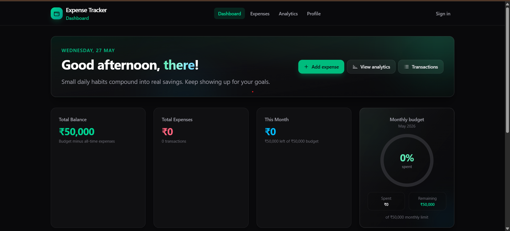
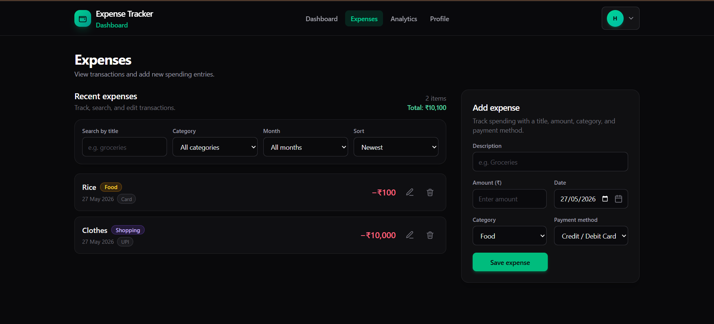
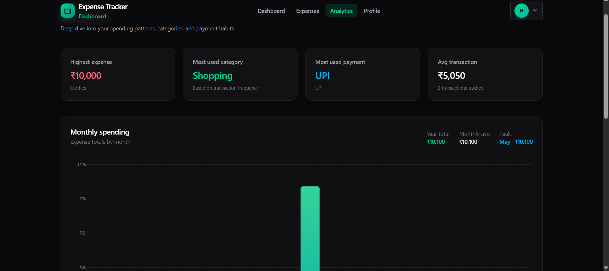
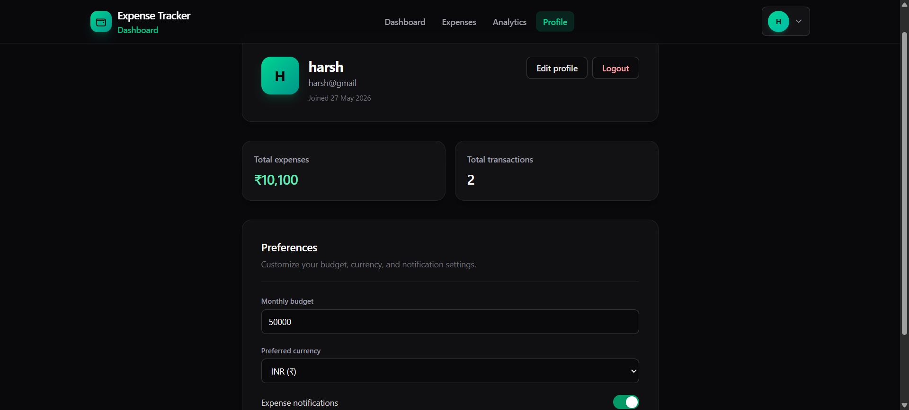

# Expense Tracker App

A modern full-stack Expense Tracker web application built with React, Vite, Tailwind CSS, and deployed on Vercel.

## Live Demo

https://expense-tracker-app-six-beta.vercel.app/

---

## Features

- Add expenses
- Edit expenses
- Delete expenses
- Category-wise analytics
- Monthly spending dashboard
- Budget tracking
- Authentication-style sign in UI
- Local storage persistence
- Responsive modern UI
- Dark theme dashboard
- Toast notifications
- Dynamic charts & analytics
- Profile settings page

---

## Tech Stack

### Frontend

- React
- Vite
- Tailwind CSS
- JavaScript
- Recharts
- Lucide React

### Deployment

- Vercel

---

---

## Screenshots

### Dashboard



### Expenses Page



### Analytics Page



### Profile Page



## Installation

Clone the repository:

```bash
git clone https://github.com/harsh-dsk/expense-tracker-app.git
```
